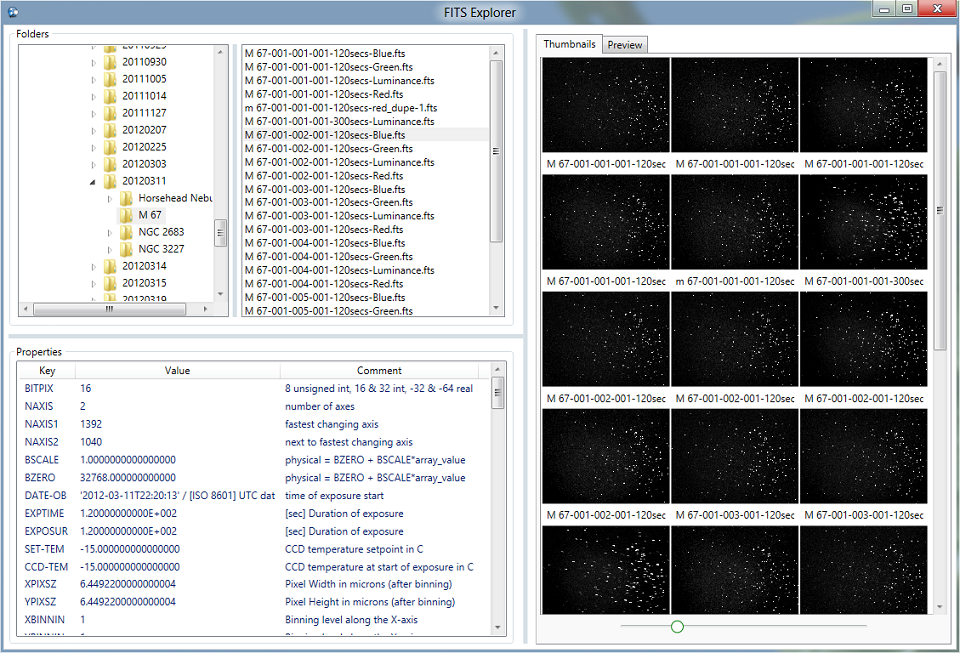

# FITSExplorer
## Astronomer's Imaging Utility

**Archived Visual Studio 2010 project that was previously held in Team Foundation Server**

FITS Explorer is designed to allow astronomers to quickly and easily browse and preview the image and metadata stored in FITS files.

This application was developed in Visual Studio 2010 using primarily WPF and C#, with some low-level data manipulation routines written in C++ for high-performance.

FITS Explorer does not make use of existing open-source FITS libraries, instead a small kernel of high-performance C++ functions has been developed to allow the creation of thumbnails and full-size previews of FITS image data. Other common image formats, such as jpeg, tiff, png, etc., are also supported.

Requirements
Windows XP (32/64-bit), Windows Vista (32/64-bit) or Windows 7 (32/64-bit)
Microsoft .NET Framework version 4 (full framework or client profile)
